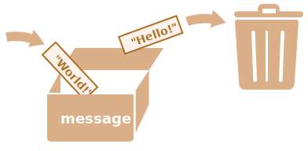

# Kintamieji

Dažniausiai JavaScript paraiška dirba su informacija. Štai du pavyzdžiai:
1. Internetinė parduotuvė -- informacija gali apimti parduodamas prekes ir pirkimo krepšelį.
2. Pokalbių programėlė -- informacija gali apimti vartotojus, žinutes ir daug daugiau.

Kintamieji (ang. variables) yra naudojami tam, kad kauptų šią informaciją. 

## Kintamasis

[Kintamasis](https://en.wikipedia.org/wiki/Variable_(computer_science)) yra "įvardinta saugykla" duomenims. Mes galime naudoti kintamuosius, kad kauptume informacines gėrybes, lankytojus ir kitus duomenis.

Norėdami sukurti kintamąjį su JavaScript, naudokite `let` raktinį žodį (ang. "keyword").

Žemiau esantis pareiškimas sukuria (kitais žodžiais: *deklaruoja*, ang.*declares*) kintamąjį su pavadinimu "message":

```js
let message;
```

Dabar į jį galime patalpinti duomenis naudodami užduoties operatorių `=`:

```js
let message;

*!*
<<<<<<< HEAD
message = 'Labas'; // patalpinama eilutė
=======
message = 'Hello'; // store the string 'Hello' in the variable named message
>>>>>>> 3c934b5a46a76861255e3a4f29da6fd54ab05c8c
*/!*
```

Dabar eilutė yra išsaugota į atminties sritį susijusią su kintamuoju. Mes galime gauti prieigą naudodami kintamojo pavadinimą. 

```js run
let message;
message = 'Labas!';

*!*
alert(message); // parodo kintamojo turinį
*/!*
```

Dėl glaustumo galime sujungti kintamojo deklaraciją ir užduotį į vieną eilę:

```js run
let message = 'Labas!'; // apibrėžti kintamąjį ir priskirti jam vertę

alert(message); // Labas!
```

Mes taip pat galime deklaruoti kelis kintamuosius vienoje eilėje:

```js no-beautify
let user = 'John', age = 25, message = 'Labas';
```

Taip atrodo trumpiau, bet iš tikrųjų nerekomenduojame šito daryti. Tam, kad būtų lengviau perskaityti kodą, rekomenduojame naudoti atskirą eilę kiekvienam kintamajam.

Kelių eilių variantas ilgesnis, bet jį lengviau perskaityti:

```js
let user = 'John';
let age = 25;
let message = 'Labas';
```

Kai kurie žmonės apibrėžia kelis kintamuosius tokiu kelių eilių stiliumi:
```js no-beautify
let user = 'John',
  age = 25,
  message = 'Labas';
```

...Arba netgi "kablelis priekyje" stiliumi:

```js no-beautify
let user = 'John'
  , age = 25
  , message = 'Labas';
```

Techniškai, visi šie variantai daro tą patį. Tad tai daugiau asmeninio skonio ir estetikos reikalas. 

<<<<<<< HEAD

````smart header="`var` vietoje `let`"
Senesniuose skriptuose galite rasti raktažodį: `var` vietoje `let`:
=======
````smart header="`var` instead of `let`"
In older scripts, you may also find another keyword: `var` instead of `let`:
>>>>>>> 3c934b5a46a76861255e3a4f29da6fd54ab05c8c

```js
*!*var*/!* message = 'Labas';
```

Raktažodis `var` yra *beveik* tas pats kaip `let`. Jis taip pat deklaruoja kintamąjį, bet šiek tiek kitokiu, "senoviniu" būdu.

Yra subtilūs skirtumai tarp `let` ir `var`, bet kol kas jie mums nėra svarbūs. Mes apie juos kalbėsime detaliau skyriuje <info:var>.
````

## Tikro gyvenimo analogija

Tam kad būtų lengviau suprasti "kintamojo" sąvoką, įsivaizduokime jį kaip "dėžę" skirtą sudėti duomenims, ant kurios priklijuotas unikaliai pavadintas lipdukas.

Pavyzdžiui kintamąjį `message` galime įsivaizduoti kaip dėžę su etikete `"message"`, kurios viduje yra patalpinta vertė `"Labas!"`:


Mes galime į dėžę įdėti bet kokią vertę.

Mes taip pat galime ją pakeisti kiek norime kartų:
```js run
let message;

message = 'Labas!';

message = 'Pasauli!'; // vertė pakeista

alert(message);
```

Kai vertė yra pakeičiama, seni duomenys panaikinami iš kintamojo:



Mes taip pat galime deklaruoti du kintamuosius ir nukopijuoti duomenis iš vieno į kitą.

```js run
let hello = 'Labas pasauli!';

let message;

*!*
// nukopijuoti 'Labas pasauli' iš hello į message
message = hello;
*/!*

// dabar abu kintamieji savyje laiko tuos pačius duomenis
alert(hello); // Labas pasauli!
alert(message); // Labas pasauli!
```

<<<<<<< HEAD
```smart header="Funkcinės kalbos"
Yra įdomu pastebėti, kad egzistuoja [funkcinės](https://en.wikipedia.org/wiki/Functional_programming) programavimo kalbos, tokios kaip [Scala](http://www.scala-lang.org/) arba [Erlang](http://www.erlang.org/), kurios draudžia keisti kintamųjų vertes.
=======
````warn header="Declaring twice triggers an error"
A variable should be declared only once.

A repeated declaration of the same variable is an error:

```js run
let message = "This";

// repeated 'let' leads to an error
let message = "That"; // SyntaxError: 'message' has already been declared
```
So, we should declare a variable once and then refer to it without `let`.
````

```smart header="Functional languages"
It's interesting to note that there exist [functional](https://en.wikipedia.org/wiki/Functional_programming) programming languages, like [Scala](http://www.scala-lang.org/) or [Erlang](http://www.erlang.org/) that forbid changing variable values.
>>>>>>> 3c934b5a46a76861255e3a4f29da6fd54ab05c8c

Tokiose kalbose, kai vertė yra patalpinama "į dėžę", ji ten ir pasilieka amžiams. Jeigu norime patalpinti kažką kito, kalba mus priverčia sukurti naują dėžę (deklaruoti naują kintamąjį). Mes nebegalime dar kartą panaudoti senojo.

Nors tai atrodo keistai iš pirmo žvilgsnio, tačiau šios kalbos yra gana gabios rimtame programų kūrime. Dar daugiau, yra tam tikrų sričių kaip lygiagretusis skaičiavimas (ang. "parallel computations") kur toks apribojimas suteikia tam tikros naudos. Studijuoti tokią kalbą (net jeigu neplanuojate jos greitu laiku naudoti) yra rekomenduotina, kad praplėstumėte savo mąstymą. 
```

## Kintamųjų įvardinimas [#variable-naming]

Yra du apribojimai kintamųjų pavadinimams JavaScript:

1. Pavadinimas gali būti sudarytas tik iš raidžių, skaitmenų arba simbolių `$` ir `_`.
2. Pirmas ženklas negali būti skaičius.

Tinkamų pavadinimų pavyzdžiai:

```js
let userName;
let test123;
```

Kai pavadinimas susideda iš kelių žodžių, dažniausiai naudojamas [camelCase](https://en.wikipedia.org/wiki/CamelCase) (tiesioginis vertimas - kupranugario atvejis). Tai reiškia: žodžiai seka vienas kitą, kiekvienas žodis išskyrus pirmąjį prasideda iš didžiosios raidės: `manoLabaiIlgasVardas`.

Įdomu -- dolerio `'$'` ir pabrėžimo `'_'` ženklai gali būti naudojami pavadinimuose. Jie yra normalūs simboliai, taip pat kaip raidės, be jokios ypatingos reikšmės.

Šie pavadinimai yra tinkami:

```js run untrusted
let $ = 1; // deklaruotas kintamasis su pavadinimu "$"
let _ = 2; // o dabar kintamasis su pavadinimu "_"

alert($ + _); // 3
```

Pavyzdžiai neteisingų pavadinimų kintamiesiems:

```js no-beautify
let 1a; // negali prasidėti skaičiumi

let my-name; // brūkšniai '-' pavadinime neleidžiami
```

```smart header="Svarbu didžiosios ar mažosios raidės"
Kintamieji su pavadinimais `obuolys` ir `obuoLYS` yra du skirtingi kintamieji.
```

````smart header="Nelotyniškos raidės leidžiamos, bet nerekomenduojamos"
Galima naudoti bet kokią kalbą, net kirilicos raides ar hieroglifus kaip pavyzdyje:

```js
let имя = '...';
let 我 = '...';
```

<<<<<<< HEAD
Techniškai jokios klaidos tame nėra ir tokie pavadinimai yra leistini, tačiau tarptautinė tradicija yra naudoti angliškus kintamųjų pavadinimus. Net jeigu rašome trumpą skriptą, jo gyvenimas gali būti labai ilgas. Kada nors žmonėms iš kitų šalių gali tekti jį perskaityti.
=======
Technically, there is no error here. Such names are allowed, but there is an international convention to use English in variable names. Even if we're writing a small script, it may have a long life ahead. People from other countries may need to read it some time.
>>>>>>> 3c934b5a46a76861255e3a4f29da6fd54ab05c8c
````

````warn header="Rezervuoti pavadinimai"
Yra [rezervuotų žodžių sąrašas](https://developer.mozilla.org/en-US/docs/Web/JavaScript/Reference/Lexical_grammar#Keywords), kurių negalima naudoti kaip kintamųjų, nes šie žodžiai yra naudojami pačioje kalboje.

Pavyzdžiui: `let`, `class`, `return` ir `function` yra rezervuoti.

Kodas apačioje grąžina sintaksės klaidą:

```js run no-beautify
let let = 5; // negalima kintamojo pavadinti "let", klaida!
let return = 5; // taip pat negalima pavadinti "return", klaida!
```
````

````warn header="Paskyrimas be `use strict`"

Dažniausiai, mums reikia apibrėžti kintamąjį prieš jį naudojant. Bet seniau techniškai buvo galima sukurti kintamąjį tiesiog priskiriant jam vertę ir nenaudojant `let`. Tai vis dar suveikia jeigu mūsų skirptuose nenurodome `use strict` skirtą palaikyti suderinamumą su senaisiais skirptais.

```js run no-strict
// atkreipkite dėmesį: "use strict" nenaudojamas šiame pavyzdyje

num = 5; // sukuriamas kintamasis "num", jeigu neegzistavo prieš tai

alert(num); // 5
```

Tai yra bloga praktika ir grąžina klaidą griežtame režime (ang. strict mode):

```js
"use strict";

*!*
num = 5; // klaida: num nėra apibrėžtas
*/!*
```
````

## Konstantos

Tam kad deklaruotume konstantą (ang. constant) (pastovų) kintamąjį, naudojame `const` vietoje `let`:

```js
const myBirthday = '18.04.1982';
```

Kintamieji deklaruoti naudojant `const` yra vadinami "konstantomis". Jie negali būti paskirti iš naujo. Bandymas tai padaryti grąžintų klaidą:

```js run
const myBirthday = '18.04.1982';

myBirthday = '01.01.2001'; // klaida, negalima priskirti konstantos iš naujo!
```

Kai programuotojas yra užtikrintas, kad kintamasis niekada nesikeis, gali deklaruoti jį su `const`, kad garantuotų ir aiškiai praneštų šį faktą ir kitiems.


### Konstantos didžiosiomis raidėmis

Plačiai paplitusi praktika naudoti konstantas kaip kodinius pavadinimus sunkiai įsimenamoms vertėms, kurios yra jau žinomos prieš atlikimą. 

Tokios konstantos pavadinamos naudojant didžiąsias raides ir pabrėžimo ženklą.

Pavyzdžiui, sukurkime konstantas spalvoms su taip vadinamu internetiniu (šešioliktainiu, ang. hexadecimal) formatu:

```js run
const COLOR_RED = "#F00";
const COLOR_GREEN = "#0F0";
const COLOR_BLUE = "#00F";
const COLOR_ORANGE = "#FF7F00";

// ...kai mums reikia išsirinkti spalvą
let color = COLOR_ORANGE;
alert(color); // #FF7F00
```

Nauda:

- `COLOR_ORANGE` daug lengviau prisiminti nei `"#FF7F00"`.
- Daug lengviau būtų įvelti klaidų spausdinant klaviatūra `"#FF7F00"` negu `COLOR_ORANGE`.
- Skaitant kodą, `COLOR_ORANGE` turės daugiau prasmės nei `#FF7F00`.

Kada turėtume naudoti didžiąsias raides konstantoms ir kada turėtume jas pavadinti normaliu būdu? Išsiaiškinkime.

Būti "konstanta" tereiškia, kad to kintamojo vertė niekada nesikeičia. Bet yra tokių konstantų, kurių vertė yra žinoma prieš kodo atlikimą (kaip pavyzdžiui šešioliktainė raudonos spalvos vertė) ir taip pat yra konstantos, kurios yra *išmatuojamos* (ang *calculated*) veikimo metu kol vykdomas kodas, bet nesikeičia po jų pradinio paskyrimo. 

Pavyzdžiui:
```js
const pageLoadTime = /* kiek laiko užtruko paliesti puslapį */;
```

Vertė `pageLoadTime` nebuvo žinoma prieš paleidžiant puslapį, tad pavadinimas užrašytas įprastiniu būdu, bet tai vis dar konstanta, nes ji nesikeičia po paskyrimo.

Kitais žodžiais, didžiosiomis raidėmis pavadintos konstantos yra naudojamos kaip kodiniai žodžiai išanksto sukoduotoms (ang "hard-coded") vertėms.  

## Pavadinkite daiktus teisingai

Kalbant apie kintamuosius yra dar vienas labai svarbus punktas.

Kintamojo pavadinimas turi turėti švarią, aiškią reikšmę, apibūdinančią duomenis, kuriuos jis saugo.

Kintamųjų įvardinimas yra viena iš svarbiausių ir sudėtingiausių sugebėjimų programuojant. Žvilgtelėjus į kintamųjų pavadinimus galima nustatyti kurį kodą parašė naujokas, o kurį jau patyręs programuotojas.

Tikrame projekte, daugiausiai laiko yra skiriama modifikuoti ir išplėsti jau esamą kodą negu rašant kažką visiškai naujo nuo pat pradžių. Kai grįžtame prie kodo po to kai kurį laiką darėme kažką kito, daug lengviau kai randi informaciją su aiškiomis etiketėmis. Arba kitaip tariant, kai kintamieji turi gerus pavadinimus.

Prašau, skirkite laiko sugalvodami kintamajam tinkamą pavadinimą prieš jį deklaruodami. Toks įprotis jums tikrai vėliau atsipirks.

Kelios sektinos taisyklės:

- Naudokite žmogui lengvai perskaitomus pavadinimus, kaip `userName` arba `shoppingCart`.
- Laikykitės atokiau nuo sutrumpinimų arba trumpų pavadinimų kaip `a`, `b`, `c`, nebent tikrai žinote ką darote.
- Pavadinimus kurkite kaip galima labiau apibūdinančius, bet glaustus. Pavyzdžiui blogi pavadinimai yra tokie kaip `data` ir `value`. Tokie pavadinimai nieko nesako. Tinka tik tokiu atveju jeigu kodo turinys yaptingai aiškiai parodo, į kuriuos "data" arba "value" kintamasis nurodo.
- Susitarkite dėl terminų su komanda ir savo mintyse. Jeigu lankytojas puslapyje yra vadinamas "user" tai ir susiję kintamieji turi būti pavadinti `currentUser` arba `newUser` vietoje `currentVisitor` arba `newManInTown`.

Skamba paprastai? Iš tikrųjų taip ir yra, bet praktikoje sukurti apibūdinančius ir tuo pačiu glaustus kintamųjų pavadinimus nėra lengva. Pabandykite.

```smart header="Panaudoti vėl ar sukurti naują?"
Ir paskutinė pastaba. Yra tingių programuotojų, kurie vietoje to, kad deklaruotų naujus kintamuosius, mėgsta dar kartą panaudoti jau egzistuojančius.

Dėl to jų kintamieji yra kaip tos dėžės į kurias kiti meta kas papuola nesivargindami pakeisti etikečių. Kas šiuo metu dėžėje? Kas žino. Tam reikia eiti arčiau ir tikrinti. 

Tokie programuotojai šiek tiek sutaupo kintamųjų deklaracijoms, bet praranda dešimt kartų daugiau laiko ieškodami ir taisydami klaidas.

Papildomas kintamasis yra gėris, ne blogis.

Modernios JavaScript minifikatoriai (kitaip - kodo sutrumpintojai, ang. minifiers) ir naršyklės pakankamai gerai optimizuoja kodą, kad nekiltų veiklos problemų. Naudodami skirtingus kintamuosius, skirtingoms vertėms netgi galite padėti sistemai optimizuoti jūsų kodą.
```

## Santrauka

Mes galime deklaruoti kintamuosius, kad talpintume duomenis naudodami `var`, `let` arba `const` raktažodžius.

- `let` -- yra moderni kintamojo deklaracija.
- `var` -- yra senoviška kintamojo deklaracija. Dažniausiai jo net nenaudojame, bet dar kalbėsime apie subtilius jo skirtumus nuo `let` skyriuje <info:var>, jeigu kartais jums jų reikėtų.
- `const` -- yra panašus į `let`, bet šio kintamojo vertė nebegali būti pakeista.

Kintamieji turi būti pavadinti taip, kad mums būtų lengva suprasti kas yra jų viduje.
