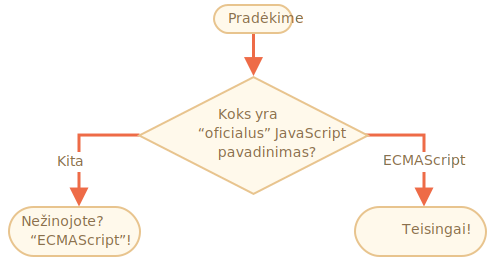

importance: 2

---

# JavaScript pavadinimas

Naudodami konstruktą `if..else`, parašykite kodą, kuris klausia: 'Koks yra "oficialus JavaScript pavadinimas?' 

<<<<<<< HEAD
Jeigu lankytojas įveda "ECMAScript", tada gaunamas "Teisingai!", kitu atveju -- gaunamas: "Nežinojote? ECMAScript!"
=======
If the visitor enters "ECMAScript", then output "Right!", otherwise -- output: "You don't know? ECMAScript!"
>>>>>>> b09e38c5573346c401a9f9f7410b4ff9be5f4115

[demo src="ifelse_task2"]
